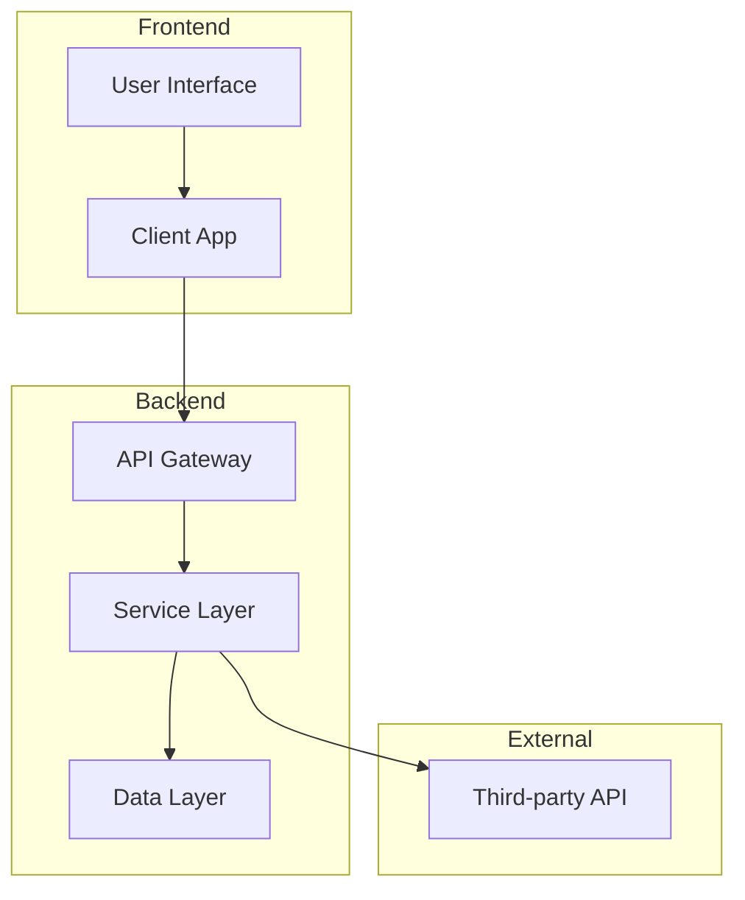
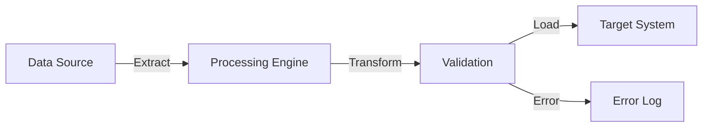
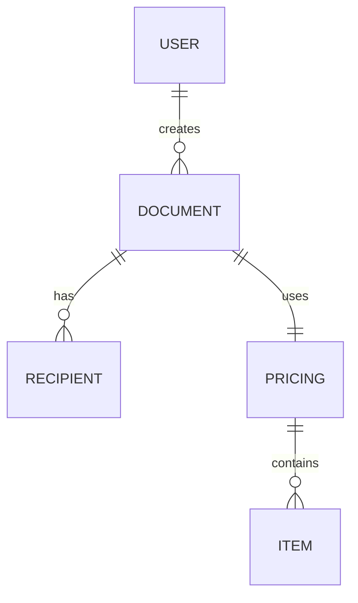

# Architecture/Schema Diagram Template

This template shows the structure for system architecture and component diagrams.

## Example: Component Architecture

## Example: Data Flow

## Example: System Relationships

