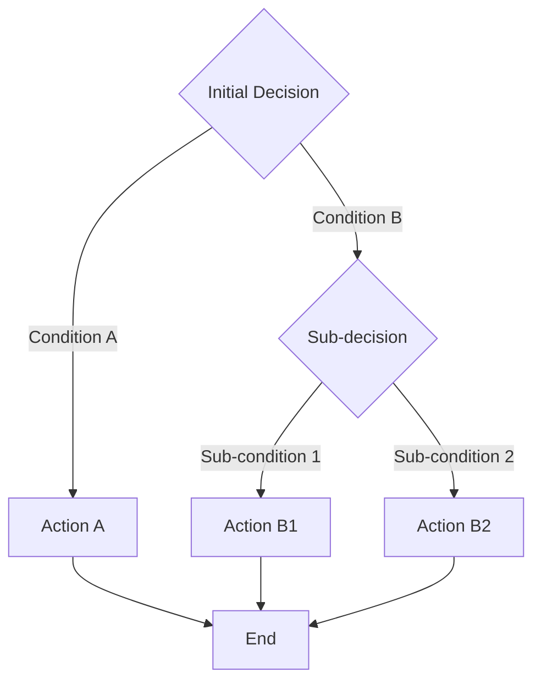
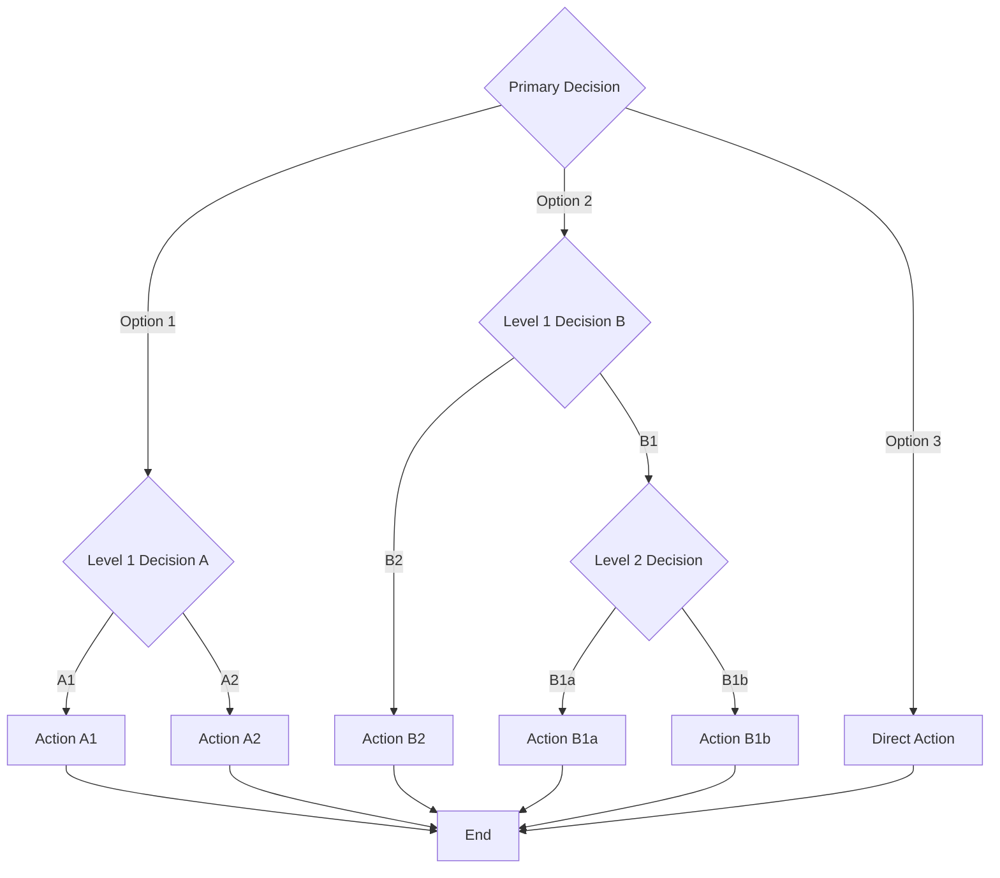

# Decision Tree Template

This template shows the structure for decision trees and branching logic.

## Example: Simple Decision Tree

## Example: Multi-level Decision Tree

## Styling Tips

- Use diamond shapes `{}` for decision points
- Use rectangles `[]` for actions/outcomes
- Use rounded rectangles `([ ])` for start/end points
- Label all edges clearly

