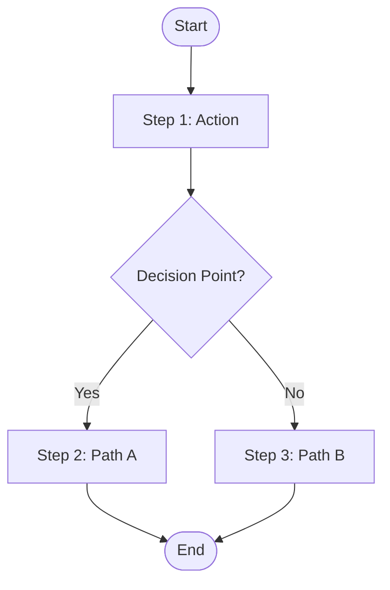
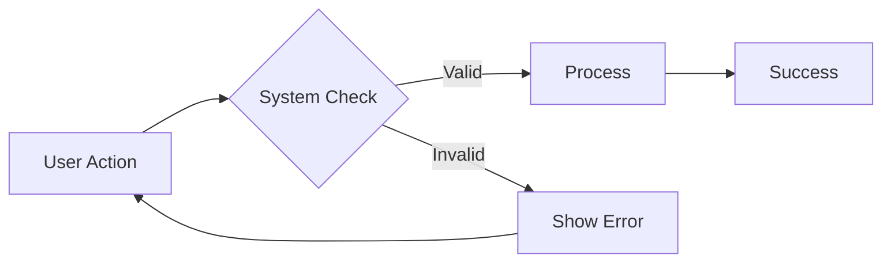
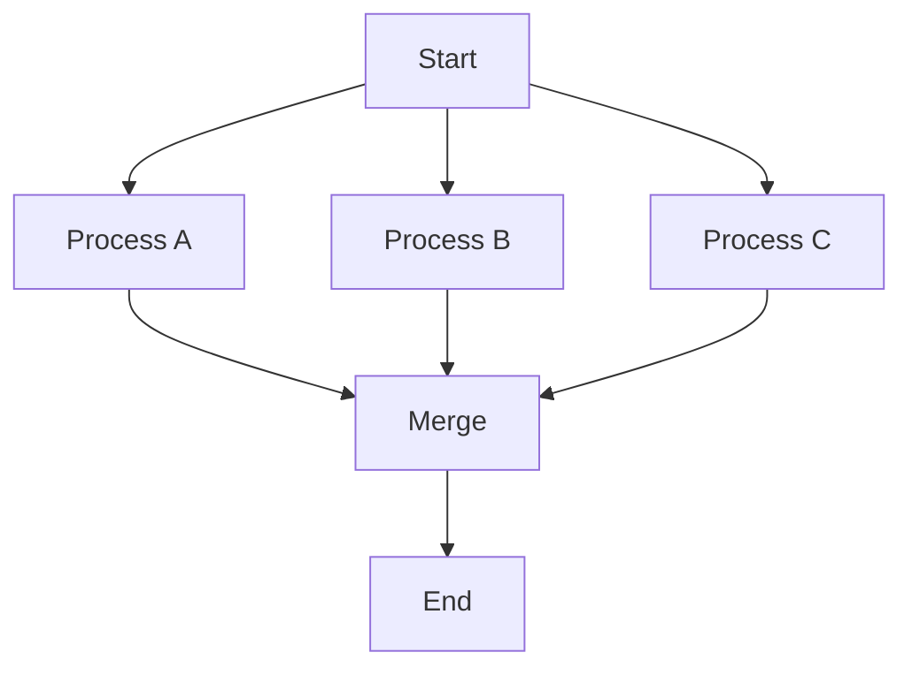
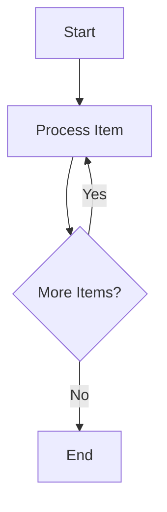

# Flow Chart Template

This template shows the structure for process/workflow flow charts.

## Example: Simple Process Flow

## Example: User Flow

## Common Patterns

### Sequential Steps

### Parallel Processes

### Loops

