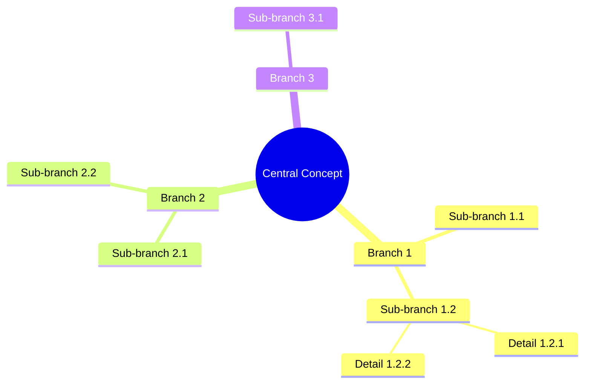
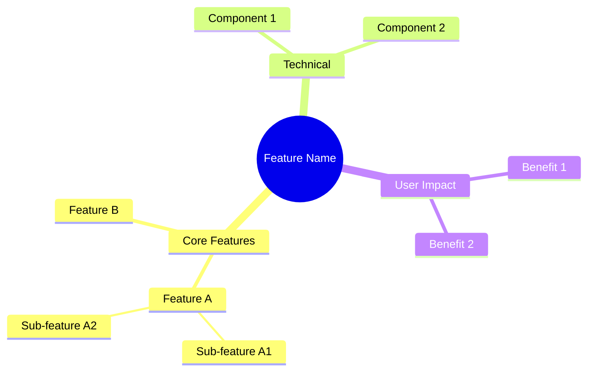
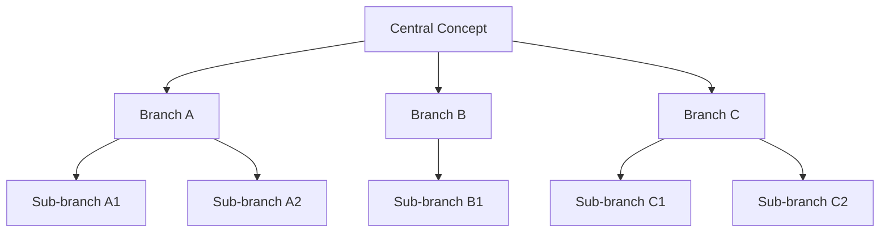

# Mind Map Template

This template shows the structure for mind maps and concept relationships.

## Example: Central Concept Mind Map

## Example: Feature Breakdown

## Alternative: Flowchart-style Mind Map

For more control, use flowchart syntax:

