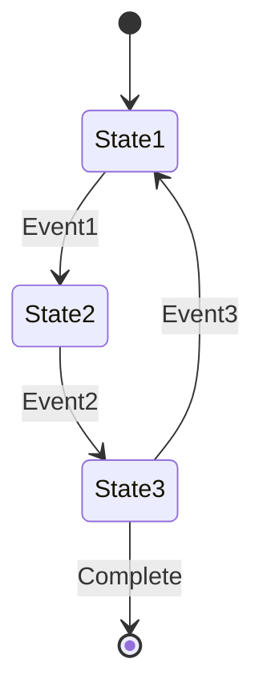
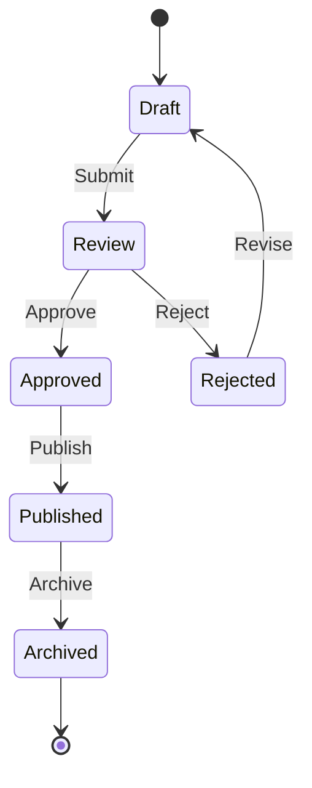
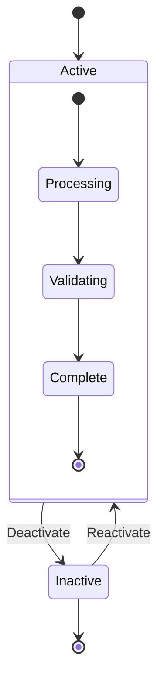

# State Diagram Template

This template shows the structure for state machines and lifecycle diagrams.

## Example: Simple State Machine

## Example: Complex State Machine

## Example: Parallel States

