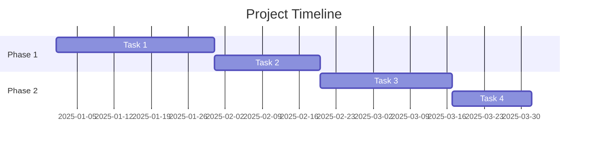
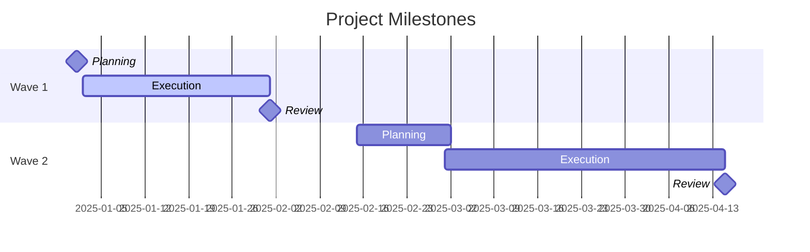
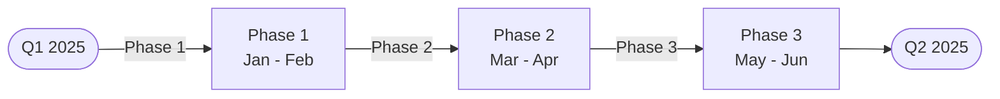

# Timeline Diagram Template

This template shows the structure for timelines and Gantt charts.

## Example: Simple Timeline

## Example: Milestone Timeline

## Alternative: Flowchart Timeline

For more visual control:

